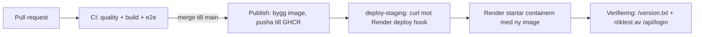

# Deploy – Kraftly Mina sidor

## Flödet



En PR bygger och testar koden, men pushar ingen image och rör inte staging –
`publish` och `deploy-staging` körs bara efter merge till `main` (styrs av
`if: github.ref == 'refs/heads/main' && github.event_name != 'pull_request'`
i `ci.yml`).

## Miljöer

| Miljö   | URL                                                           | Image                                                                     | API                                      | Uppdateras                              |
| ------- | ------------------------------------------------------------- | ------------------------------------------------------------------------- | ---------------------------------------- | --------------------------------------- |
| Lokalt  | http://localhost:5173 (dev) / http://localhost:8080 (compose) | Byggs lokalt från `Dockerfile`                                            | Eget mock-API på `localhost:4000`        | Manuellt, `docker compose up --build`   |
| Staging | `https://team-ampere-staging.onrender.com`                    | `ghcr.io/leoengberg/team-ampere:ba6ba3e1e0ca6397adac3ce2d2424f1973b00bf5` | https://kraftly-api-staging.onrender.com | Automatiskt vid varje merge till `main` |

## Konfiguration

| Variabel             | Hemlig?   | Lokalt                                                         | Staging                                                                                                                                                   | Används av                                                                                                     |
| -------------------- | --------- | -------------------------------------------------------------- | --------------------------------------------------------------------------------------------------------------------------------------------------------- | -------------------------------------------------------------------------------------------------------------- |
| `API_KEY`            | Ja        | `.env` (valfritt värde, delat mellan mock-API och Vite-proxyn) | Render → Environment, på **web**-tjänsten. Samma värde måste sättas hos IT-avdelningen/Jonatan för test-API:t (teamnyckeln kom via DM, aldrig i en kanal) | `nginx.conf.template` (skickar den som header `X-Api-Key`), `mock-api/server.js` lokalt (kontrollerar mot den) |
| `API_URL`            | Nej       | `http://localhost:4000`                                        | Test-API:ts adress https://kraftly-api-staging.onrender.com                                                                                               | `nginx.conf.template` (`proxy_pass`), `vite.config.js` i dev                                                   |
| `PORT`               | Nej       | `80` (satt i `Dockerfile` med `ENV PORT=80`)                   | Sätts automatiskt av Render                                                                                                                               | `nginx.conf.template` (`listen ${PORT}`)                                                                       |
| `RENDER_DEPLOY_HOOK` | Ja        | Finns inte lokalt                                              | GitHub → Settings → Environments → `staging` → **Secret**                                                                                                 | `deploy-staging`-jobbet, säger åt Render vilken image som ska köras                                            |
| `STAGING_URL`        | Nej       | Finns inte lokalt                                              | GitHub → Settings → Environments → `staging` → **Variable**                                                                                               | `deploy-staging`-jobbet, för att polla `/version.txt` och köra röktestet mot `/api/login`                      |
| `GITHUB_TOKEN`       | Ja (auto) | Finns inte lokalt                                              | Skapas automatiskt av GitHub Actions för varje körning                                                                                                    | `publish`-jobbet, för att logga in mot GHCR och pusha imagen                                                   |

## API-nyckeln

Den gamla nyckeln (`kraftly_live_sk_...`) låg hårdkodad i
`src/services/api.js` sedan byrån lämnade över projektet – vilket betyder
att vem som helst som öppnade DevTools i webbläsaren, eller läste repots
historik, kunde se den.

Vi bevisade att den är avstängd genom att testa tre anrop mot test-API:t
(`https://kraftly-api-staging.onrender.com`) med curl:

```
$ API=https://kraftly-api-staging.onrender.com

$ curl -s -w " %{http_code}\n" $API/api/user
{"error":"Saknad eller ogiltig API-nyckel"} 401

$ curl -s -w " %{http_code}\n" -H "X-Api-Key:77e7e94d84b716c1cd61e45db268ee4c" $API/api/user
{"id":1,"name":"Anna Andersson","email":"anna.andersson@example.com","address":"Solvägen 12, 802 67 Gävle","contract":"Rörligt pris","customerNo":"K-104233"} 200

$ curl -s -w " %{http_code}\n" -H "X-Api-Key: kraftly_live_sk_9f3a71bd42e88c015d6f" $API/api/user
{"error":"Saknad eller ogiltig API-nyckel"} 401
```

Alltså exakt 401 · 200 · 401: utan nyckel avvisas man, med vår riktiga
teamnyckel svarar API:t med kunddata, och den gamla nyckeln som låg
hårdkodad i `src/services/api.js` är död och ger samma 401 som att inte
skicka någon nyckel alls.

Den nya nyckeln finns bara på två ställen: i varje utvecklares egen
`.env`-fil (aldrig committad, ligger i `.gitignore`) och i Render →
Environment på **web**-tjänsten. Den skickas aldrig till klienten – nginx
lägger på den på servern, se `nginx.conf.template`.

## Rollback

**Sätt 1 – Redeploy en tidigare version i Render**

1. Gå till tjänsten i Render → fliken **Events** (eller **Deploys**).
2. Hitta den senaste körning som var grön/fungerande innan problemet.
3. Klicka **Rollback** på den.
4. Verifiera: öppna `<staging-url>/version.txt` och kontrollera att det
   visar den äldre, kända commit-shan.

**Sätt 2 – Kör deploy-hooken manuellt mot en äldre image**

1. Hitta en tidigare commit-sha som byggdes grönt (GitHub → Packages →
   paketet → lista över taggar, eller `Actions`-loggen för `publish`-jobbet).
2. Kör samma anrop som CI gör, fast med den gamla shan:

```
   IMAGE="ghcr.io/[org/repo]:<gammal-sha>"
   ENCODED=$(jq -rn --arg u "$IMAGE" '$u|@uri')
   curl -fsS -X POST "$RENDER_DEPLOY_HOOK&imgURL=${ENCODED}"
```

3. Verifiera på samma sätt: `/version.txt` ska visa `<gammal-sha>`.
   Det säkraste sättet framåt är förstås att `git revert` en trasig commit på
   `main` och låta pipelinen bygga och deploya en ny, korrigerad version –
   sätt 1 och 2 ovan är för akuta lägen när man inte kan vänta på en ny
   pipeline-körning.

## Tider (uppmätta)

| Steg                                                | Tid       |
| --------------------------------------------------- | --------- |
| Merge till `main` → `publish`-jobbet klart          | `[1m49s]` |
| Deploy hook anropas → `/version.txt` visar rätt sha | `[10.5s]` |
| Total tid, merge → staging klart och verifierat     | `[2m29s]` |
| Kallstart (första anropet efter viloläge)           | `[10.0s]` |

Mät genom att jämföra tidsstämpeln för merge-committen mot tidsstämplarna i
Actions-loggen och i Render → Events.

## Kända begränsningar

- **Kallstart**: staging-tjänsten somnar efter 15 minuters inaktivitet på
  Renders gratisnivå. Första anropet efter det kan ta upp till en minut –
  därför har vi satt `proxy_read_timeout 90s` i `nginx.conf.template`, så
  att nginx inte ger upp innan API:t hunnit vakna.
- **Vem äger Render-kontot**: `Rabbiya (Tech Lead)`. Vid nästa tech lead-byte
  ska ägarskapet (inloggning, deploy hook, miljövariabler) lämnas över
  uttryckligen, inte bara "ligga kvar" hos en person.
- **arm64 vs amd64**: imagen byggs i GitHub Actions på `ubuntu-latest`,
  vilket är amd64/x86. Render kör också amd64, så det fungerar. Den som
  bygger lokalt på en Mac med Apple Silicon (arm64) kan få en image som
  fungerar lokalt men inte är samma arkitektur som den som faktiskt pushas
  till GHCR och körs i molnet – lita därför på CI-imagen, inte en lokalt
  byggd, om ni felsöker skillnader mellan din dator och staging.
- **Ingen produktionsmiljö ännu**: allt ovan gäller staging. Det finns
  ingen separat prod-miljö, inga hälsokontroller/larm, och nyckeln är en
  delad statisk sträng snarare än riktig inloggning per användare – se
  `docs/decisions/hosting.md` för vad det skulle kräva att gå vidare till
  produktion.
