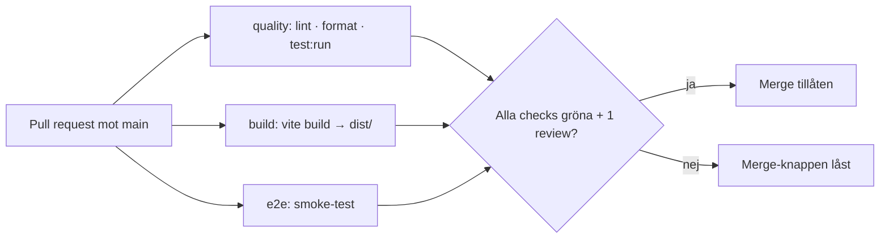
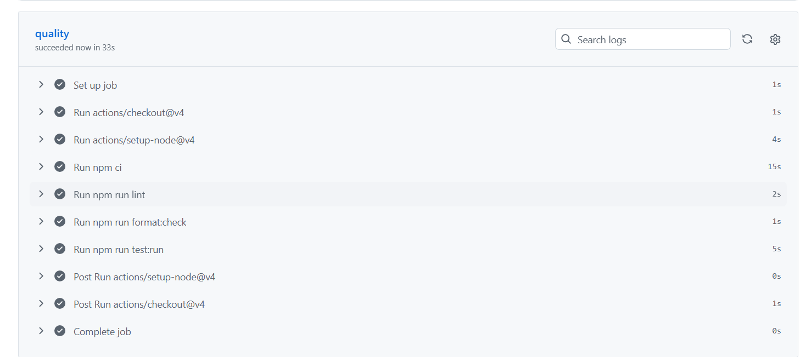
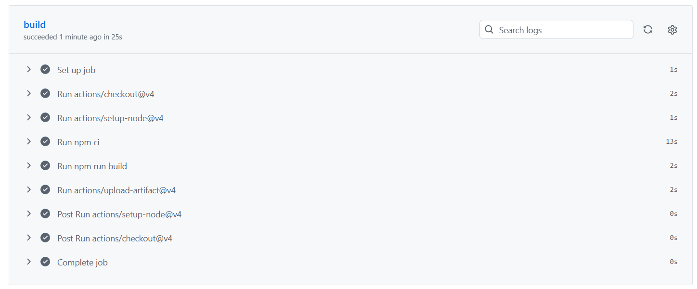
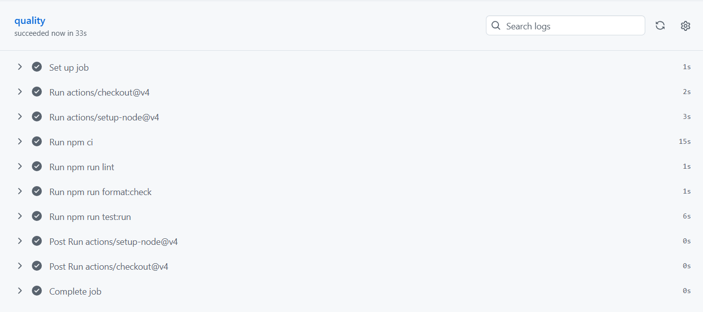
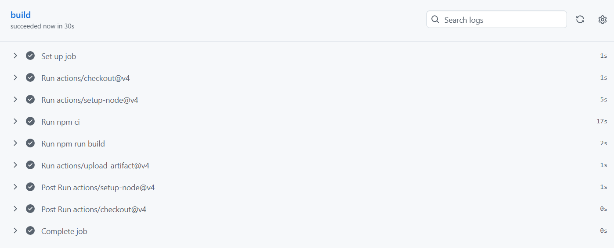
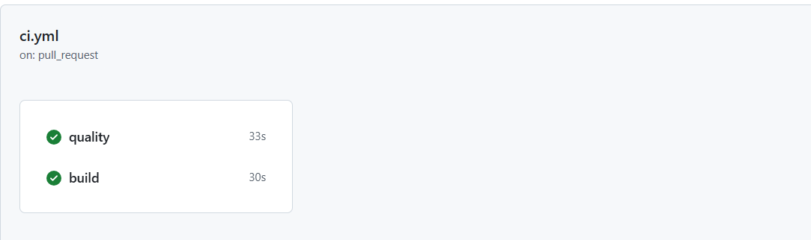

# Pipeline – Kraftly Mina sidor

## Flöde

## Beslut 1 · Jobb: parallellt eller i serie?

Hur ni delade upp jobben och varför. Vad kostar det i minuter, vad ger det i svarstid?
Parallellet. Total blev 48s.

## Beslut 2 · Vad krävs för merge?

Vilka checks är required, hur många approvals, up to date ja/nej, bypass för någon?
Build, Quality, e2e. 1 approval, up to date ja, ingen bypass för någon.

## Beslut 3 · Protokoll vid röd main

Vem gör vad, inom vilken tid. Laga framåt eller revert – var går gränsen? (Aldrig runt.)

## Byggtid: före och efter npm-cache

| Steg             | Utan cache | Med cache |
| ---------------- | ---------- | --------- |
| npm ci (quality) | 33s        | 33s       |
| npm ci (build)   | 25s        | 30s       |
| Hela körningen   | 58s        | 63s       |

Skärmdumpar:
Utan cache: 

Med cache: 

## Skärmdump: låst merge-knapp
